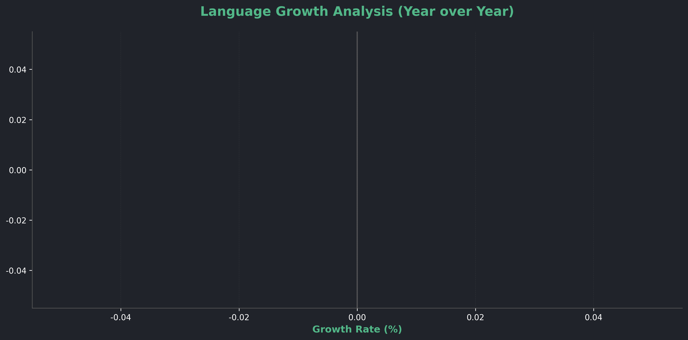

 

<h1 align="center">✨ Zlaepek Profile ✨</h1>

 

<!-- GitHub 통계 - 높이 맞춤 -->

  
  

 

<!-- 현재 상태 -->

 

<!-- 자동 업데이트 섹션들 -->

## Tech Stack & Trends (Auto-Updated)

<!-- SKILL_START -->
### 현재 주력 스킬
 ███████████░░░ **[EXPERT]**  

### 발전중인 스킬
 ███████░░░░░░░  
 ███████░░░░░░░  
 ██████░░░░░░░░  
 ██████░░░░░░░░  

<!-- SKILL_END -->

 

## Language Trend Analysis (Auto-Updated)

<!-- TREND_CHART -->

<!-- /TREND_CHART -->

### 기술 전환 스토리
**Unity 게임 개발 → 웹 풀스택 전환 과정**

<!-- GROWTH_CHART -->
  
<!-- /GROWTH_CHART -->

### 주요 변화 포인트
**2024년 11월**: PTAHLABS 창업 → JavaScript/Python 급상승  
**2024년 8-10월**: 웹 개발 학습 집중 → TypeScript 도입  
**2023-2024년**: Unity + C# 전문가 시절 (디캐릭)  
**2019-2023년**: 기초 학습 + 대학 과정

 

## Weekly Development Report (Auto-Generated)

<!-- WEEKLY_START -->
**이번 주 주력 분야:**  
**Backend Development** (45%) - API 개발 및 최적화  
**Business Strategy** (25%) - 기획, 팀 리딩  
**Frontend** (20%) - UI/UX 개선  
**DevOps** (10%) - 인프라 관리  

**최근 활동:**  
- `zlaepek/zlaepek`: Update generate-charts.yml (09-07)  
- `zlaepek/zlaepek`: 수정 (09-07)  
- `zlaepek/zlaepek`: 테스트 (09-07)  
- `wnj719/WebSite`: 배포 설정 변경

url에서 readme.md가 보이는 것을 index.html로 보이게끔 변경 (08-28)  
- `2025-Ptahlabs/WebSite`: Update README.md (08-28)  
<!-- WEEKLY_END -->

 

## Profile Overview

<table>
  <tr>
    <td align="center"><strong>Name</strong></td>
    <td align="center">김민경 (Zlaepek)</td>
  </tr>
  <tr>
    <td align="center"><strong>Position</strong></td>
    <td align="center">CEO & Tech Lead @ <a href="https://ptahlabs.co.kr/">PTAHLABS</a></td>
  </tr>
  <tr>
    <td align="center"><strong>Email</strong></td>
    <td align="center">alice4813@naver.com</td>
  </tr>
  <tr>
    <td align="center"><strong>Education</strong></td>
    <td align="center">가천대학교 소프트웨어학과 (2019-2023)</td>
  </tr>
</table>

 

## Career Journey

<table>
  <thead>
    <tr>
      <th>Company</th>
      <th>Position</th>
      <th>Period</th>
      <th>Main Stack</th>
    </tr>
  </thead>
  <tbody>
    <tr>
      <td><a href="https://ptahlabs.co.kr/">PTAHLABS</a></td>
      <td>CEO & Founder</td>
      <td>2024.11 ~ Present</td>
      <td>JavaScript, Python, React, AWS</td>
    </tr>
    <tr>
      <td><a href="https://www.dcarrick.co.kr/">디캐릭</a></td>
      <td>Unity Developer</td>
      <td>2023.02 ~ 2024.10</td>
      <td>C#, Unity, MRTK, Photon, AWS</td>
    </tr>
  </tbody>
</table>

 

## Latest Activity (Auto-Updated)

<!-- ACTIVITY_START -->
**Recent Commits:**  
- `zlaepek/zlaepek`: Update generate-charts.yml  
- `zlaepek/zlaepek`: 수정  
- `zlaepek/zlaepek`: 테스트  

**This Month:**  
- 5 commits across multiple repositories  
- 새로운 기술 스택 학습 진행중  
- 프로젝트 마일스톤 달성  
<!-- ACTIVITY_END -->

 

---

*이 프로필은 GitHub Actions로 자동 업데이트됩니다*  
*마지막 업데이트: <!-- UPDATE_TIME -->2025-09-07 18:46 KST<!-- /UPDATE_TIME -->*

