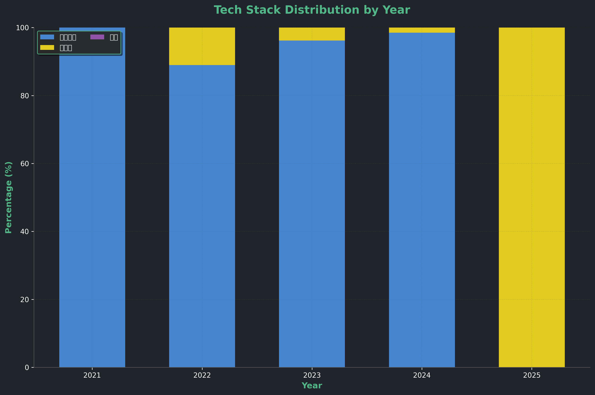
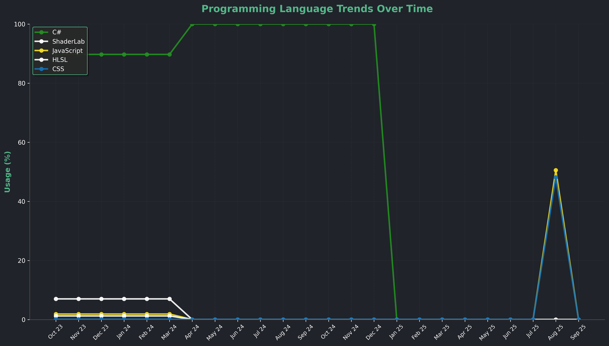

# 김민경
**Software Developer**

*Auto-updated: <!-- UPDATE_TIME -->2025-11-01 10:58 KST<!-- /UPDATE_TIME -->*

### Career Journey

<table width="100%">
  <thead>
    <tr>
      <th width="50%">Organization</th>
      <th width="25%">Position</th>
      <th width="25%">Period</th>
    </tr>
  </thead>
  <tbody>
    <tr>
      <td><a href="https://ptahlabs.co.kr/">PTAHLABS</a></td>
      <td>Tech Lead</td>
      <td>2024.11~</td>
    </tr>
    <tr>
      <td><a href="https://www.dcarrick.co.kr/">디캐릭</a></td>
      <td>Unity Dev</td>
      <td>2023.02~2024.10</td>
    </tr>
    <tr>
      <td>가천대학교</td>
      <td>소프트웨어학과</td>
      <td>2019.03~2023.02</td>
    </tr>
  </tbody>
</table>

---

### Recent Activity

<!-- ACTIVITY_START -->
<table width="100%">
  <thead>
    <tr>
      <th width="30%">Project</th>
      <th width="25%">Stack</th>
      <th width="45%">Details</th>
    </tr>
  </thead>
  <tbody>
    <tr>
      <td><a href="https://ptahlabs.co.kr/#/project/Solution_PhotoBooth">포토부스</a></td>
      <td>JavaScript</td>
      <td>이벤트용 포토부스 앱</td>
    </tr>
    <tr>
      <td>과학관 사이트</td>
      <td>React</td>
      <td>과학관 웹사이트 개발</td>
    </tr>
    <tr>
      <td><a href="https://github.com/zlaepek">포트폴리오</a></td>
      <td>GitHub Pages, GitHub Actions</td>
      <td>개인 포트폴리오 사이트 개선</td>
    </tr>
  </tbody>
</table>
<!-- ACTIVITY_END -->

---

### Skills Overview

<table width="100%">
<tr>
<td valign="top" width="50%">

<!-- SKILL_START -->
<table width="100%">
  <thead>
    <tr>
      <th width="70%">기술 스택</th>
      <th width="30%">숙련도</th>
    </tr>
  </thead>
  <tbody>
    <tr>
      <td></td>
      <td>🥈 62%</td>
    </tr>
    <tr>
      <td></td>
      <td>🥉 45%</td>
    </tr>
  </tbody>
</table>
<!-- SKILL_END -->

레벨 계산 방식

🥇 Master 80%+ | 🥈 Pro 60-79% | 🥉 Learning 40-59% | 🏅 Starter <40% 
<code>활동점수 = (언어 줄 수 ÷ 100) + (커밋 수 × 10)</code> 
<code>레벨 = min(99, floor(log₂(활동점수 + 1) × 8))</code>

</td>
<td valign="top" width="50%">

<!-- YEARLY_CHART -->

<!-- /YEARLY_CHART -->

</td>
</tr>
</table>

---

### My Tech Focus 2025

<table width="100%">
<tr>
<td valign="top" width="50%">

<!-- TREND_START -->
<table width="100%">
  <thead>
    <tr>
      <th width="70%">Field</th>
      <th width="30%">Growth</th>
    </tr>
  </thead>
  <tbody>
    <tr>
      <td></td>
      <td>+50%</td>
    </tr>
    <tr>
      <td></td>
      <td>+38%</td>
    </tr>
    <tr>
      <td></td>
      <td>-32%</td>
    </tr>
  </tbody>
</table>
<!-- TREND_END -->

변화율 계산 방식

<code>변화율 = (최근 3개월 활동 - 이전 9개월 평균) ÷ 이전 9개월 평균 × 100</code> 
양수: 증가 추세 | 음수: 감소 추세

</td>
<td valign="top" width="50%">

<!-- TREND_CHART -->

<!-- /TREND_CHART -->

</td>
</tr>
</table>

---

## GitHub Analytics

<table width="100%">
<tr>
<td valign="top" width="33%">

**Profile Stats**

</td>
<td valign="top" width="34%">

**Language Distribution**

</td>
<td valign="top" width="33%">

**Contribution Streak**

</td>
</tr>
</table>

