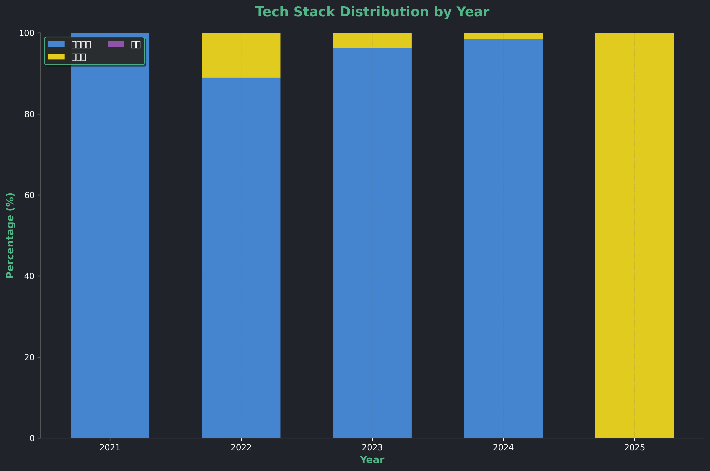

<div align="center">
  <h1>김민경's git stat</h1>
</div>

## Career Journey

<div align="center">
<table>
  <thead>
    <tr>
      <th>Organization</th>
      <th>Position</th>
      <th>Period</th>
      <th>Main Stack</th>
    </tr>
  </thead>
  <tbody>
    <tr>
      <td><a href="https://ptahlabs.co.kr/">PTAHLABS</a></td>
      <td>Tech Lead</td>
      <td>2024.11 ~ Present</td>
      <td>JavaScript, Python, React, AWS</td>
    </tr>
    <tr>
      <td><a href="https://www.dcarrick.co.kr/">디캐릭</a></td>
      <td>Unity Developer</td>
      <td>2023.02 ~ 2024.10</td>
      <td>C#, Unity, MRTK, Photon, AWS</td>
    </tr>
    <tr>
      <td>가천대학교</td>
      <td>소프트웨어학과</td>
      <td>2019.03 ~ 2023.02</td>
      <td>Java, C, Python, Algorithm</td>
    </tr>
  </tbody>
</table>
</div>

---

## Current Status & Skills (Auto-Updated)

<!-- SKILL_START -->
<div align="center">
<table>
  <thead>
    <tr>
      <th>기술 스택</th>
      <th>숙련도</th>
      <th>랭크</th>
    </tr>
  </thead>
  <tbody>
    <tr>
      <td></td>
      <td></td>
      <td></td>
    </tr>
    <tr>
      <td></td>
      <td></td>
      <td></td>
    </tr>
    <tr>
      <td></td>
      <td></td>
      <td></td>
    </tr>
    <tr>
      <td></td>
      <td></td>
      <td></td>
    </tr>
  </tbody>
</table>
</div>
<!-- SKILL_END -->

<details>
<summary><sub>레벨 계산 방식</sub></summary>
<sub>

```
활동점수 = (언어 줄 수 ÷ 100) + (커밋 수 × 10)
레벨 = min(99, floor(log₂(활동점수 + 1) × 8))
```

</sub>
</details>

---

## 2025 기술 스택 변화 추이 (Auto-Updated)

<div align="center">

<!-- TREND_START -->
<table>
  <thead>
    <tr>
      <th align="center" width="120">분야</th>
      <th align="center" width="80">변화율</th>
      <th align="center" width="200">주요 기술</th>
      <th align="center" width="300">주요 프로젝트</th>
    </tr>
  </thead>
  <tbody>
  </tbody>
</table>
<!-- TREND_END -->

</div>

<details>
<summary><sub>변화율 계산 방식</sub></summary>
<sub>

```
변화율 = (최근 3개월 활동 - 이전 9개월 평균) ÷ 이전 9개월 평균 × 100
양수: 증가 추세, 음수: 감소 추세
```

</sub>
</details>

## 2025 Language Trend Analysis

<!-- TREND_CHART -->

<!-- /TREND_CHART -->

<!-- YEARLY_CHART -->

<!-- /YEARLY_CHART -->

---

## GitHub Analytics

<div align="center">

<!-- GitHub 통계 카드들 -->


<!-- 연속 커밋 통계 -->


<!-- 활동 그래프 -->


<br/>

<!-- 프로필 뱃지들 -->


</div>

<br>


## Latest Activity (Auto-Updated)

<!-- ACTIVITY_START -->
**Recent Projects:**  
- `zlaepek/zlaepek`: 수정 (5 commits)  

**This Month:**  
- 5 commits across 1 repositories  
- 새로운 기술 스택 학습 진행중  
- 프로젝트 마일스톤 달성  
<!-- ACTIVITY_END -->

<br>

---

<div align="center">

*이 프로필은 GitHub Actions로 자동 업데이트됩니다*  
*마지막 업데이트: <!-- UPDATE_TIME -->2025-09-25 08:50 KST<!-- /UPDATE_TIME -->*

</div>