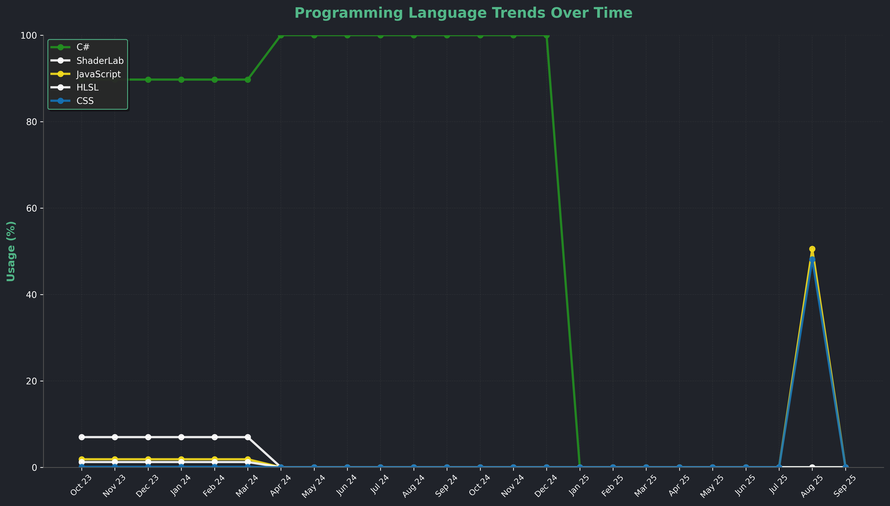
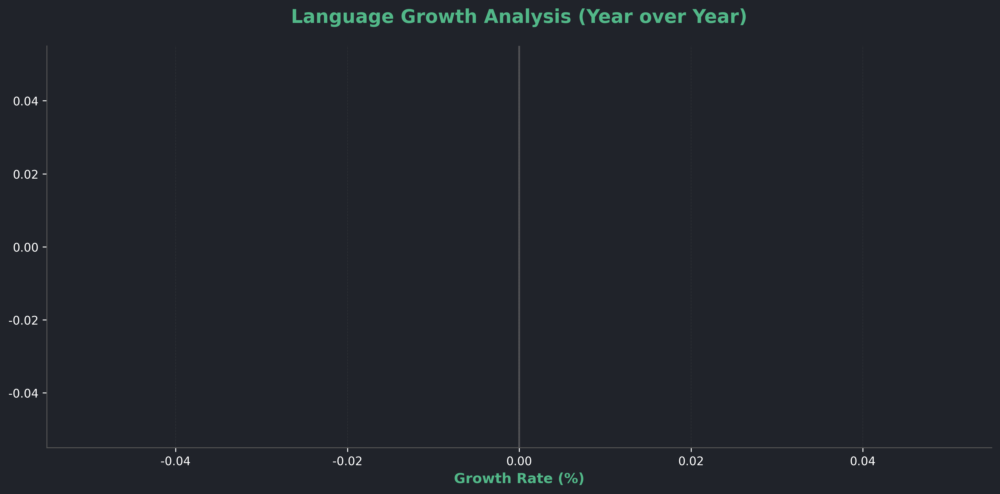

<div align="center">
  <h1>김민경 (Zlaepek)</h1>
  <p><strong>Full Stack Developer | CEO @ PTAHLABS</strong></p>
</div>

## Profile Overview

<div align="center">
<table width="80%" style="margin: 0 auto; border-collapse: collapse;">
  <tr style="border: 1px solid #ddd;">
    <td align="center" width="50%" style="padding: 12px; font-weight: bold; background-color: #f8f9fa;">Name</td>
    <td align="center" width="50%" style="padding: 12px;">김민경 (Zlaepek)</td>
  </tr>
  <tr style="border: 1px solid #ddd;">
    <td align="center" width="50%" style="padding: 12px; font-weight: bold; background-color: #f8f9fa;">Position</td>
    <td align="center" width="50%" style="padding: 12px;">CEO & Tech Lead @ <a href="https://ptahlabs.co.kr/">PTAHLABS</a></td>
  </tr>
  <tr style="border: 1px solid #ddd;">
    <td align="center" width="50%" style="padding: 12px; font-weight: bold; background-color: #f8f9fa;">Email</td>
    <td align="center" width="50%" style="padding: 12px;">alice4813@naver.com</td>
  </tr>
</table>
</div>

## Career Journey

<div align="center">
<table width="90%" style="margin: 0 auto; border-collapse: collapse;">
  <thead>
    <tr style="background-color: #f1f3f4;">
      <th width="25%" style="padding: 12px; border: 1px solid #ddd; text-align: center;">Organization</th>
      <th width="25%" style="padding: 12px; border: 1px solid #ddd; text-align: center;">Position</th>
      <th width="25%" style="padding: 12px; border: 1px solid #ddd; text-align: center;">Period</th>
      <th width="25%" style="padding: 12px; border: 1px solid #ddd; text-align: center;">Main Stack</th>
    </tr>
  </thead>
  <tbody>
    <tr style="border: 1px solid #ddd;">
      <td style="padding: 10px; text-align: center;"><a href="https://ptahlabs.co.kr/">PTAHLABS</a></td>
      <td style="padding: 10px; text-align: center;">CEO & Founder</td>
      <td style="padding: 10px; text-align: center;">2024.11 ~ Present</td>
      <td style="padding: 10px; text-align: center;">JavaScript, Python, React, AWS</td>
    </tr>
    <tr style="border: 1px solid #ddd;">
      <td style="padding: 10px; text-align: center;"><a href="https://www.dcarrick.co.kr/">디캐릭</a></td>
      <td style="padding: 10px; text-align: center;">Unity Developer</td>
      <td style="padding: 10px; text-align: center;">2023.02 ~ 2024.10</td>
      <td style="padding: 10px; text-align: center;">C#, Unity, MRTK, Photon, AWS</td>
    </tr>
    <tr style="border: 1px solid #ddd;">
      <td style="padding: 10px; text-align: center;">가천대학교</td>
      <td style="padding: 10px; text-align: center;">소프트웨어학과</td>
      <td style="padding: 10px; text-align: center;">2019.03 ~ 2023.02</td>
      <td style="padding: 10px; text-align: center;">Java, C, Python, Algorithm</td>
    </tr>
  </tbody>
</table>
</div>

---

## 2025 기술 스택 변화 추이 (Auto-Updated)

<div align="center">

<!-- TREND_START -->
<table>
  <thead>
    <tr>
      <th align="center" width="120">분야</th>
      <th align="center" width="80">변화율</th>
      <th align="center" width="200">주요 기술</th>
      <th align="center" width="300">현재 상황</th>
    </tr>
  </thead>
  <tbody>
    <tr>
      <td align="center"></td>
      <td align="center"><span style="color: #e74c3c; font-weight: bold;">-32%</span></td>
      <td align="center">C#, Unity</td>
      <td align="left">PTAHLABS에서도 활용, 비중 감소</td>
    </tr>
    <tr>
      <td align="center"></td>
      <td align="center"><span style="color: #52b788; font-weight: bold;">+45%</span></td>
      <td align="center">JavaScript, HTML, CSS, React</td>
      <td align="left">React, Node.js 집중 학습 중</td>
    </tr>
  </tbody>
</table>
<!-- TREND_END -->

</div>

---

## Current Status & Skills (Auto-Updated)

<!-- SKILL_START -->
<div align="center">
<table width="95%" style="margin: 0 auto; border-collapse: collapse;">
  <thead>
    <tr style="background-color: #f1f3f4;">
      <th width="25%" style="padding: 12px; border: 1px solid #ddd; text-align: center;">기술 스택</th>
      <th width="15%" style="padding: 12px; border: 1px solid #ddd; text-align: center;">레벨</th>
      <th width="35%" style="padding: 12px; border: 1px solid #ddd; text-align: center;">숙련도</th>
      <th width="25%" style="padding: 12px; border: 1px solid #ddd; text-align: center;">랭크</th>
    </tr>
  </thead>
  <tbody>
    <tr style="border: 1px solid #ddd;">
      <td style="padding: 10px; text-align: center;"></td>
      <td style="padding: 10px; text-align: center;"><strong>80</strong></td>
      <td style="padding: 10px; text-align: center;"></td>
      <td style="padding: 10px; text-align: center;"></td>
    </tr>
    <tr style="border: 1px solid #ddd;">
      <td style="padding: 10px; text-align: center;"></td>
      <td style="padding: 10px; text-align: center;"><strong>50</strong></td>
      <td style="padding: 10px; text-align: center;"></td>
      <td style="padding: 10px; text-align: center;"></td>
    </tr>
    <tr style="border: 1px solid #ddd;">
      <td style="padding: 10px; text-align: center;"></td>
      <td style="padding: 10px; text-align: center;"><strong>48</strong></td>
      <td style="padding: 10px; text-align: center;"></td>
      <td style="padding: 10px; text-align: center;"></td>
    </tr>
    <tr style="border: 1px solid #ddd;">
      <td style="padding: 10px; text-align: center;"></td>
      <td style="padding: 10px; text-align: center;"><strong>42</strong></td>
      <td style="padding: 10px; text-align: center;"></td>
      <td style="padding: 10px; text-align: center;"></td>
    </tr>
  </tbody>
</table>
</div>
<!-- SKILL_END -->

### 레벨 계산 방식
스킬 레벨은 **실제 GitHub 데이터**를 기반으로 자동 계산됩니다:

```
활동점수 = (언어 바이트 수 ÷ 1,000) + (커밋 수 × 10)
레벨 = min(99, floor(log₂(활동점수 + 1) × 8))
```

---

## Language Trend Analysis (Auto-Updated)

<!-- TREND_CHART -->

<!-- /TREND_CHART -->

<!-- GROWTH_CHART -->
  
<!-- /GROWTH_CHART -->

---

## GitHub Analytics

<div align="center">

<!-- GitHub 통계 카드들 -->


<!-- 연속 커밋 통계 -->


<!-- 활동 그래프 -->


<br/>

<!-- 프로필 뱃지들 -->


</div>

<br>


## Weekly Development Report (Auto-Generated)

<!-- WEEKLY_START -->
**이번 주 주력 분야:**  
**Backend Development** (45%) - API 개발 및 최적화  
**Business Strategy** (25%) - 기획, 팀 리딩  
**Frontend** (20%) - UI/UX 개선  
**DevOps** (10%) - 인프라 관리  

**최근 활동:**  
- `zlaepek/zlaepek`: 줄수로 수정 (09-07)  
- `zlaepek/zlaepek`: 수정 (09-07)  
- `zlaepek/zlaepek`: 수정2 (09-07)  
- `zlaepek/zlaepek`: 디자인 수정 (09-07)  
- `zlaepek/zlaepek`: 수정 (09-07)  
<!-- WEEKLY_END -->

<br>

## Latest Activity (Auto-Updated)

<!-- ACTIVITY_START -->
**Recent Commits:**  
- `zlaepek/zlaepek`: 줄수로 수정  
- `zlaepek/zlaepek`: 수정  
- `zlaepek/zlaepek`: 수정2  

**This Month:**  
- 5 commits across multiple repositories  
- 새로운 기술 스택 학습 진행중  
- 프로젝트 마일스톤 달성  
<!-- ACTIVITY_END -->

<br>

---

<div align="center">

*이 프로필은 GitHub Actions로 자동 업데이트됩니다*  
*마지막 업데이트: <!-- UPDATE_TIME -->2025-09-07 21:08 KST<!-- /UPDATE_TIME -->*

</div>