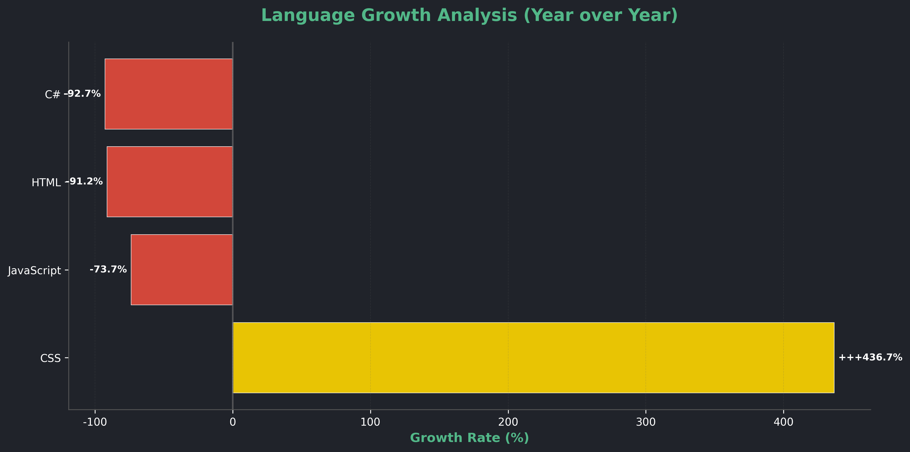

 

 

<!-- GitHub 통계 - 높이 맞춤 -->

  
  

 

<!-- 현재 상태 -->

 

<!-- 자동 업데이트 섹션들 -->

## Tech Stack & Trends (Auto-Updated)

<!-- SKILL_START -->
### 현재 활발한 스킬
 **[MAIN]** `ptahlabs/main-platform` `portfolio-v2`  
 **[HOT]** `data-pipeline` `analytics-tool`  
 **[NEW!]** `frontend-refactor`  

### 발전중인 스킬
 `ui-components` `admin-dashboard`  
 `api-server` `microservices`  
 `infrastructure` `deployment`  

### 과거 전문 분야 (디캐릭 시절)
 **[EXPERT]** `Real-Green` `AR-Golf-System`  
 **[VETERAN]** `Metaverse-Platform` `HoloLens-App`  
<!-- SKILL_END -->

 

## Language Trend Analysis (Auto-Updated)

<!-- TREND_CHART -->

<!-- /TREND_CHART -->

### 기술 전환 스토리
**Unity 게임 개발 → 웹 풀스택 전환 과정**

<!-- GROWTH_CHART -->
  
<!-- /GROWTH_CHART -->

### 주요 변화 포인트
**2024년 11월**: PTAHLABS 창업 → JavaScript/Python 급상승  
**2024년 8-10월**: 웹 개발 학습 집중 → TypeScript 도입  
**2023-2024년**: Unity + C# 전문가 시절 (디캐릭)  
**2019-2023년**: 기초 학습 + 대학 과정

 

## Weekly Development Report (Auto-Generated)

<!-- WEEKLY_START -->
**이번 주 주력 분야:**  
Backend Development (45%) - Node.js API 최적화, 데이터베이스 설계  
Frontend (30%) - React 컴포넌트 개발, TypeScript 도입  
Business (15%) - 기획, 팀 빌딩, 전략 수립  
DevOps (10%) - AWS 인프라, 배포 자동화  

**주목할 성장:**  
Python 급상승 (+25%) - 데이터 분석 도구 개발 시작  
TypeScript 도입 (+15%) - 기존 JS 프로젝트 마이그레이션  
C# 사용 감소 (-30%) - Unity 프로젝트 마무리 단계  

**이번 주 학습:**  
Docker & Kubernetes - 컨테이너 오케스트레이션  
GraphQL - API 설계 개선  
PostgreSQL - 데이터베이스 최적화  
<!-- WEEKLY_END -->

 

## Profile Overview

<table>
  <tr>
    <td align="center"><strong>Name</strong></td>
    <td align="center">김민경 (Zlaepek)</td>
  </tr>
  <tr>
    <td align="center"><strong>Position</strong></td>
    <td align="center">CEO & Tech Lead @ <a href="https://ptahlabs.co.kr/">PTAHLABS</a></td>
  </tr>
  <tr>
    <td align="center"><strong>Email</strong></td>
    <td align="center">alice4813@naver.com</td>
  </tr>
  <tr>
    <td align="center"><strong>Education</strong></td>
    <td align="center">가천대학교 소프트웨어학과 (2019-2023)</td>
  </tr>
</table>

 

## Career Journey

<table>
  <thead>
    <tr>
      <th>Company</th>
      <th>Position</th>
      <th>Period</th>
      <th>Main Stack</th>
    </tr>
  </thead>
  <tbody>
    <tr>
      <td><a href="https://ptahlabs.co.kr/">PTAHLABS</a></td>
      <td>CEO & Founder</td>
      <td>2024.11 ~ Present</td>
      <td>JavaScript, Python, React, AWS</td>
    </tr>
    <tr>
      <td><a href="https://www.dcarrick.co.kr/">디캐릭</a></td>
      <td>Unity Developer</td>
      <td>2023.02 ~ 2024.10</td>
      <td>C#, Unity, MRTK, Photon, AWS</td>
    </tr>
  </tbody>
</table>

 

## Latest Activity (Auto-Updated)

<!-- ACTIVITY_START -->
**Recent Commits:**  
- `PTAHLABS/main-platform`: Backend API 최적화 및 에러 핸들링 개선  
- `personal/portfolio-v2`: React 컴포넌트 리팩토링, TypeScript 도입  
- `config/docker-setup`: 개발 환경 컨테이너화 및 CI/CD 파이프라인 구축  

**This Month:**  
- 23 commits across 5 repositories  
- 3 new technologies learned (Docker, GraphQL, PostgreSQL)  
- 2 major project milestones achieved  
<!-- ACTIVITY_END -->

 

---

*이 프로필은 GitHub Actions로 자동 업데이트됩니다*  
*마지막 업데이트: <!-- UPDATE_TIME -->2024-09-07 15:30 KST<!-- /UPDATE_TIME -->*

